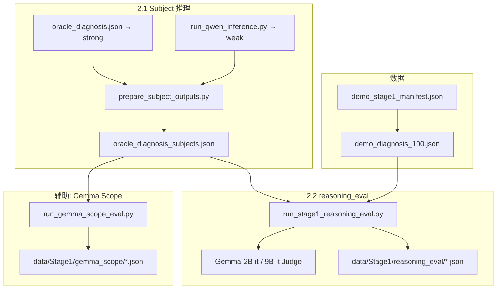
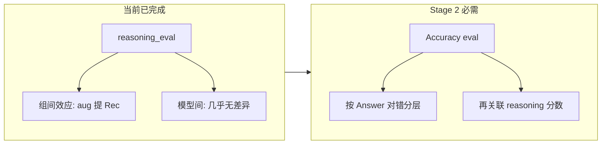

# Stage 1 实验总报告：Demo 数据集推理评估

> **环境**：GPU-P100-2（2× P100 16GB）  
> **数据**：`demo_diagnosis_100.json` / `demo_treatment_100.json`（各 100 例，seed=42）  
> **更新**：2026-06-13（含 Gemma-2B-it 完整结果、Gemma-9B-it 部分结果与逐 case 分析）

---

## 1. 实验目标

| 编号 | 内容 |
|------|------|
| **Stage 1** | 选 100 diagnosis + 100 treatment 作为 demo，先跑通全流程再决定 Stage 2 |
| **2.1** | 推理能力分层：**Strong** = o3-mini、deepseek-r1（API）；**Weak** = qwen3-8b、qwen3-14b（本地） |
| **2.2** | Gemma 2B / 9B 推理评估（MedRBench 三指标），**两组**：① **direct** 仅推理过程；② **inference_augmented** 推理 + 模型最终推断 |
| **P.S.** | 回答与推理均有对有错；先完成实验、汇总统计，再定下一步 |

**核心问题**：reasoning_eval 能否区分 Strong / Weak 模型？inference_augmented 组是否有效提升 Completeness？

---

## 2. Demo 100 例如何选取

### 2.1 脚本与数据源

由 `scripts/data/build_demo_subset.py` 生成，配置记录在 `data/MedRBench/demo_stage1_manifest.json`。

| 任务 | 全量池 | 规模 | Demo 输出 |
|------|--------|------|-----------|
| **Diagnosis** | `diagnosis_957_cases_with_rare_disease_491.json` | 957 例（491 rare） | `demo_diagnosis_100.json` |
| **Treatment** | `treatment_496_cases_with_rare_disease_165.json` | 496 例（165 rare） | `demo_treatment_100.json` |

**随机种子**：`seed=42`（可复现）。

### 2.2 抽样算法

**Diagnosis（100 例）— 两阶段**

1. **强制纳入**：`test_cases.json` 中的 **35 例全部入选**（与 MedRBench 官方 35 例子集对齐）。
2. **再抽 65 例**：从剩余池中按 **与全库相同的 rare 比例** 分层随机抽样（`checked_rare_disease` 非空视为 rare）。

**Treatment（100 例）**：从 496 例池中按 rare 比例分层随机抽 100 例（无 test35 强制纳入）。

### 2.3 分布情况

#### Diagnosis demo（100 例）

| 维度 | Demo 100 | 全库 957 |
|------|----------|----------|
| **Rare 病例** | **65（65.0%）** | 491（51.3%） |
| **含 test35** | 35/35 | — |

**body_category（top）**：Brain and Nerves (24)、Digestive (14)、Bones/Joints/Muscles (11)、Blood/Heart (10) 等。

**disorder_category（top）**：Cancers (34)、Infections (30)、Genetics/Birth Defects (19) 等。

#### Treatment demo（100 例）

| 维度 | Demo 100 | 全库 496 |
|------|----------|----------|
| **Rare 病例** | **51（51.0%）** | 165（33.3%） |

Treatment demo 的 rare 占比 **明显高于** 全库，评估时需知 demo 偏 rare / 复杂病例。

### 2.4 复现命令

```bash
python scripts/data/build_demo_subset.py --seed 42
```

---

## 3. 实验流程



### 3.1 评估指标（MedRBench `reasoning_eval.py`，无 web search）

| 指标 | 含义 |
|------|------|
| **Efficiency** | 有效推理步占比（非冗余、非无关步骤） |
| **Factuality** | Reasoning 步中事实正确比例 |
| **Completeness (recall)** | GT 推理步骤被 subject 推理链覆盖的比例 |

### 3.2 两组设计

| 组别 | 输入 |
|------|------|
| **direct** | 仅 `<step N>` 推理链 |
| **inference_augmented** | 推理链 + 末尾追加 `Final model inference: {Answer}` |

### 3.3 命令速查

```bash
# Subject 合并
python scripts/stage1/prepare_subject_outputs.py --task diagnosis

# 弱模型推理
python scripts/stage1/run_qwen_inference.py --task diagnosis --model qwen3-8b

# 2B Judge
conda activate gemma_scope
export EVAL_DISABLE_WEB_SEARCH=1
python scripts/stage1/run_stage1_reasoning_eval.py \
  --task diagnosis --subject-model o3-mini \
  --judge gemma-local --gemma-size 2b

# 9B Judge（P100：4bit 单卡）
export CUDA_VISIBLE_DEVICES=0
export GEMMA_JUDGE_9B_MODE=4bit
python scripts/stage1/run_stage1_reasoning_eval.py \
  --task diagnosis --subject-model qwen3-8b \
  --judge gemma-local --gemma-size 9b

# 双卡并行 9B（o3 + deepseek）
bash scripts/stage1/run_gemma9b_reasoning_eval_dual.sh start

# 汇总与分析
python scripts/stage1/stage1_full_summary.py
python scripts/stage1/analyze_per_case_model_gap.py --judge gemma-2b-it --group direct
python scripts/stage1/analyze_gemma9b_partial.py
python scripts/stage1/summarize_gemma_scope.py
```

---

## 4. 完成度

### 4.1 Subject 推理（diagnosis）

| 模型 | 分层 | 覆盖 |
|------|------|------|
| o3-mini | Strong | **100/100** |
| deepseek-r1 | Strong | **100/100** |
| qwen3-8b | Weak | **100/100** |
| qwen3-14b | Weak | **0/100**（bnb/CUDA 环境阻塞，待 GPU 空闲后 fp16-split） |
| treatment 100 例 | — | **未开始** |

### 4.2 reasoning_eval（Gemma-it Judge，diagnosis）

| Judge | Subject | direct | inference_augmented |
|-------|---------|--------|---------------------|
| **Gemma-2B-it** | o3-mini | ✅ 100/100 | ✅ 100/100 |
| | deepseek-r1 | ✅ 100/100 | ✅ 100/100 |
| | qwen3-8b | ✅ 100/100 | ✅ 100/100 |
| **Gemma-9B-it** | qwen3-8b | ✅ 100/100 | ✅ 100/100 |
| | o3-mini | 🔄 **28/100** | ❌ 未跑 |
| | deepseek-r1 | 🔄 **28/100** | ❌ 未跑 |

### 4.3 Gemma Scope 辅助评估（1–5 分，direct / sae_augmented）

| Judge | Subject | direct | sae_augmented |
|-------|---------|--------|-----------------|
| Gemma-2B | o3 / deepseek / qwen | 部分 parse 失败 | reparsed 后可用 |
| **Gemma-9B** | o3 / deepseek / qwen | ✅ 100/100，**全部 5.0** | ✅ 100/100，**全部 5.0** |

---

## 5. 结果汇总

### 5.1 Gemma-2B-it（完整，100 例 × 3 模型 × 2 组）

#### 聚合均值

| Subject | 组别 | Efficiency | Factuality | Completeness |
|---------|------|------------|------------|--------------|
| o3-mini | direct | **99.3%** | **93.4%** | 78.5% |
| | inference_augmented | 98.9% | 92.9% | 79.7% |
| deepseek-r1 | direct | **99.7%** | 92.4% | 78.2% |
| | inference_augmented | 99.6% | 92.1% | **80.7%** |
| qwen3-8b | direct | 99.6% | 92.2% | 78.8% |
| | inference_augmented | 99.1% | 92.2% | **80.7%** |

#### 组间效应（direct → aug，均值变化）

| Subject | Eff | Fact | Rec |
|---------|-----|------|-----|
| o3-mini | −0.4 pp | −0.5 pp | **+1.2 pp** |
| deepseek-r1 | −0.1 pp | −0.3 pp | **+2.5 pp** |
| qwen3-8b | −0.5 pp | 0.0 pp | **+1.8 pp** |

**结论**：inference_augmented 稳定提高 Completeness（+1.2 ~ +2.5 pp），Efficiency / Factuality 几乎不变。三组设计 **有效**。

#### 模型间差异

三模型聚合均值差 **< 1.5 pp**，Efficiency ~99% 饱和，**无法用 2B Judge 区分 Strong / Weak**。

---

### 5.2 Gemma-2B-it 逐 case 三模型分析（100 例，direct）

脚本：`scripts/stage1/analyze_per_case_model_gap.py --judge gemma-2b-it --group direct`

#### Case 内分差（三模型 max−min）

| 指标 | mean | median | range=0 的 case | range≥0.2 |
|------|------|--------|-----------------|-----------|
| Efficiency | 0.015 | **0.000** | 94/100 | 3/100 |
| Factuality | 0.140 | 0.143 | 41/100 | 22/100 |
| Completeness | 0.194 | 0.154 | 17/100 | **39/100** |

Completeness 是唯一有一定分化的维度，但 **case 难度（between-case）占 63% 方差**，模型间差距（within-case）占 56%，二者量级相当——**个体差异大于模型差异**。

#### 模型对 Completeness 的相关性

| 模型对 | Pearson r |
|--------|-----------|
| o3 ↔ deepseek | 0.476 |
| o3 ↔ qwen | 0.424 |
| deepseek ↔ qwen | 0.425 |

三模型在同一 case 上的 Completeness **中等正相关**（同难同易），而非「强模型系统性高于弱模型」。

#### qwen vs o3 Completeness 差距（≥0.2）

| 方向 | case 数 |
|------|---------|
| qwen **低于** o3 | 13/100 |
| qwen **高于** o3 | 11/100 |

**对称分布，无稳定 weak 信号**。

#### 高分差典型 case

| Case ID | 特征 |
|---------|------|
| PMC11395317 | Comp spread=0.83；qwen Rec=0.17，o3=0.67 |
| PMC11452711 | qwen Rec=0.33，o3/deepseek=1.00 |
| PMC11364916 | qwen=1.00，o3=0.25（反例） |

---

### 5.3 Gemma-9B-it（部分完成 + qwen 完整）

#### qwen3-8b（100/100，direct + aug）

| 组别 | Efficiency | Factuality | Completeness |
|------|------------|------------|--------------|
| **direct** | 97.6% | 95.4% | 96.4% |
| **inference_augmented** | 89.9% | 94.4% | 96.1% |
| **Δ aug−direct** | **−7.6 pp** | −1.0 pp | −0.4 pp |

**分布（direct / aug）**：

| 指标 | direct（median） | aug（median） | triple≥0.999 |
|------|------------------|---------------|--------------|
| Eff | 1.00 | **0.88** | 53% → **27%** |
| Fact | 1.00 | 1.00 | — |
| Rec | 1.00 | 1.00 | — |

9B Judge **整体分数显著高于 2B**（Rec +18 pp），但 aug 组 **Efficiency 明显下降**——长推理链 + 最终推断被 9B 判为冗余/低效。这是 9B 相比 2B 最清晰的组间信号。

#### o3 / deepseek（各 28/100，direct，进行中）

| Subject | Eff | Fact | Rec |
|---------|-----|------|-----|
| o3-mini (n=28) | 95.9% | 95.9% | 96.3% |
| deepseek-r1 (n=28) | 98.4% | 93.8% | **91.8%** |
| qwen3-8b（28-case 交集） | 95.0% | **98.7%** | 96.7% |

**28-case 三模型交集分析**：

| 指标 | spread median | spread≥0.2 |
|------|---------------|------------|
| Eff | 0.000 | 2/28 |
| Fact | 0.000 | 4/28 |
| Rec | 0.000 | 4/28 |

早期信号：deepseek Rec 略低（91.8% vs o3 96.3%），Rec 最低频次 deepseek=23/28——但 **样本仅 28 例，尚不能下最终结论**。

#### 9B vs 2B Judge 对比（同 case）

| Subject | n | Eff Δ(9B−2B) | Fact Δ | Rec Δ | Rec 相关 r |
|---------|---|--------------|--------|-------|------------|
| qwen3-8b | 100 | −2.1 pp | +3.2 pp | **+17.6 pp** | 0.068 |
| o3-mini | 28 | −2.9 pp | +0.9 pp | +17.4 pp | 0.158 |
| deepseek-r1 | 28 | −1.6 pp | +4.8 pp | +13.7 pp | 0.721 |

- 9B **更慷慨**（尤其 Completeness +14~18 pp）
- 9B 与 2B **排序几乎不一致**（qwen Rec r≈0.07）——两个 Judge 评的不是同一维度
- 9B 在 Efficiency 上 ceiling 更低，**更能反映 aug 组的效率代价**

---

### 5.4 Gemma Scope 辅助评估（1–5 分）

| Judge | Subject | direct mean | sae_augmented mean | Δ |
|-------|---------|-------------|-------------------|---|
| 2B (reparsed) | deepseek-r1 | 4.65 | 4.07 | −0.58 |
| 2B (reparsed) | o3-mini | 4.93 | — | — |
| 2B (reparsed) | qwen3-8b | 4.71* | 4.20 | −0.51 |
| **9B** | **全部三模型** | **5.00** | **5.00** | **0.00** |

\* qwen 2B direct 仅 7/100 parse 成功，分数不可靠。

**结论**：Gemma-9B Scope **完全饱和**（100/100 全 5 分），无法用于模型分层。2B Scope 有 sae_augmented 降分趋势（−0.5 ~ −0.9），但 qwen parse 率极低，不宜作为主结论依据。

---

## 6. 综合结论

### 6.1 实验目标达成情况

| 目标 | 结论 | 证据 |
|------|------|------|
| Demo 流程跑通 | ✅ | diagnosis 100 例 subject + 2B eval 全完成 |
| 2.2 两组设计有效 | ✅ | 2B：Rec +1.2~2.5 pp；9B qwen：Eff −7.6 pp（aug 代价可见） |
| 2.1 Strong/Weak 分层 | ❌ | 2B 三指标无法区分；9B 28-case 有 weak 信号但未确认 |
| Accuracy（诊断对错） | ⏳ 未做 | reasoning_eval ≠ 最终诊断正确性 |

### 6.2 核心认识

1. **reasoning_eval 评的是「推理链质量」**，不是最终 Answer 是否正确。Strong 模型（o3/deepseek）与 Weak 模型（qwen3-8b）在推理链层面 **高度相似**——可能都「像样」但 Answer 对错不同。
2. **Judge 选择影响巨大**：2B 给 Rec ~79%，9B 给 Rec ~96%；两者 case 级相关极低。**不能混用 Judge 做跨实验比较**。
3. **Efficiency 在 2B 上饱和**（~99%），在 9B 上对 aug 组敏感——若关注推理效率，9B Judge 更有区分度。
4. **Completeness 是 2B 上最有信息的维度**（39/100 case spread≥0.2），但 qwen 低分 case（13）与高分 case（11） **大致对称**，不构成稳定 weak 标签。
5. **Case 难度主导**：Completeness 63% 方差来自 case 间差异，评估需足够样本量并按 case 分层解读。

### 6.3 方法学启示



---

## 7. 环境与运维记录

| 项目 | 说明 |
|------|------|
| `gemma_scope` conda | torch 2.1.2，transformers 4.44.x；Gemma Judge |
| `qwen3_infer` conda | Qwen3 本地推理 |
| 9B Judge | P100 推荐 `GEMMA_JUDGE_9B_MODE=4bit` + 单卡 ~11GB |
| 双卡 9B | `run_gemma9b_reasoning_eval_dual.sh`：GPU0=o3，GPU1=deepseek |
| qwen3-14b | bnb 0.42 `.to()` 问题；AWQ 编译失败（CentOS）；待 fp16-split |
| 断点续跑 | `status==ok` 跳过，`error` 重试；每例写盘 |
| Gemma 9B qwen aug | 单卡 4bit 跑数天；tmux 可断但进程可续 |

---

## 8. Stage 2 建议

| 优先级 | 任务 | 理由 |
|--------|------|------|
| **P0** | **Diagnosis Accuracy eval** | 区分 strong/weak 的必要条件 |
| **P1** | 9B o3/deepseek 跑满 100/100 + aug | 完成 9B 三模型对比 |
| **P1** | qwen3-14b inference | 补 weak 组第二个模型 |
| **P2** | Treatment 100 例全流程 | 扩展任务类型 |
| **P2** | Accuracy × reasoning 交叉分析 | 推断错但推理高分的 case 分析 |
| **P3** | 更强 Judge 或 GPT-4 Judge | 若 9B 100-case 仍无分层 |

---

## 9. 产出文件索引

| 路径 | 说明 |
|------|------|
| `data/MedRBench/demo_stage1_manifest.json` | 100 例 ID、seed、数据源 |
| `data/MedRBench/demo_diagnosis_100.json` | Diagnosis demo 全字段 |
| `data/Stage1/oracle_diagnosis_subjects.json` | 合并 subject 输出 |
| `data/Stage1/inference/qwen3-8b_diagnosis.json` | Qwen3-8B 原始推理 |
| `data/Stage1/reasoning_eval/diagnosis_gemma-{2b,9b}-it_{subject}_{group}.json` | reasoning_eval 结果 |
| `data/Stage1/gemma_scope/diagnosis_{2b,9b}_{subject}.json` | Scope 1–5 分评估 |
| `scripts/stage1/run_stage1_reasoning_eval.py` | 2.2 主评估 |
| `scripts/stage1/analyze_per_case_model_gap.py` | 三模型逐 case 分差 |
| `scripts/stage1/analyze_gemma9b_partial.py` | 9B 汇总（含部分数据） |
| `scripts/stage1/stage1_full_summary.py` | 覆盖率 + 分布 |
| `scripts/stage1/run_gemma9b_reasoning_eval_dual.sh` | 双卡 9B 并行 |

---

## 10. 附录：输入 / 输出示例

### 10.1 Subject 输出格式（o3-mini 节选）

```text
### Reasoning:
<step 1> The patient is a 13-year-old male presenting with severe left eye pain...

<step 6> The combination of orbital cellulitis, maxillary sinusitis, and frontal
epidural empyema suggests infection spreading beyond sinuses and orbit.

### Answer:
Orbital cellulitis with associated maxillary sinusitis and frontal epidural empyema.
```

### 10.2 inference_augmented 构造

在 direct 的 `<step N>` 列表末尾追加：

```text
Final model inference: Orbital cellulitis with associated maxillary sinusitis and frontal epidural empyema.
```

### 10.3 reasoning_eval 输出（case 级）

文件：`data/Stage1/reasoning_eval/diagnosis_gemma-2b-it_o3-mini_direct.json`

```json
{
  "status": "ok",
  "group": "direct",
  "step_count": 6,
  "efficiency": 1.0,
  "factulity": 1.0,
  "recall": 0.9
}
```

---

*报告由 `scripts/stage1/stage1_full_summary.py`、`analyze_per_case_model_gap.py`、`analyze_gemma9b_partial.py`、`summarize_gemma_scope.py` 输出汇总生成。*
