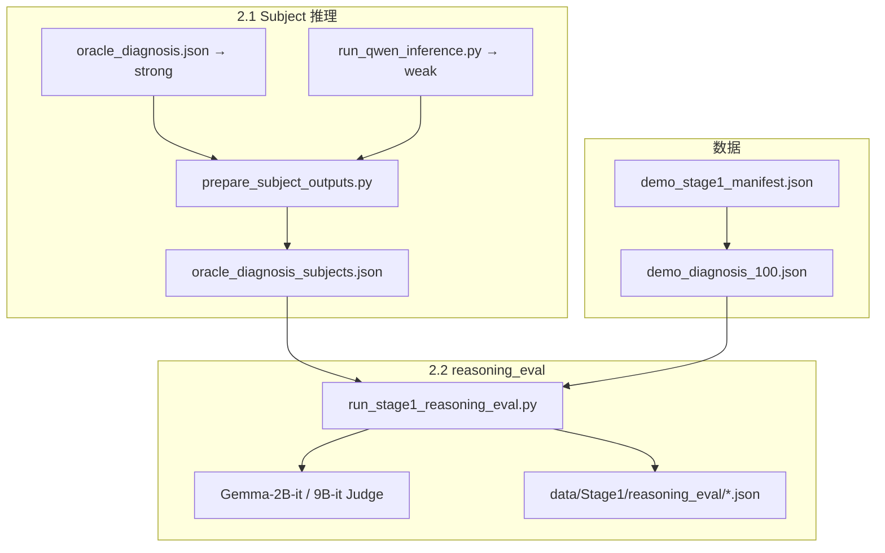

# Stage 1 实验报告：Demo 数据集推理评估

> **环境**：GPU-P100-2（2× P100 16GB）  
> **数据**：`demo_diagnosis_100.json` / `demo_treatment_100.json`（各 100 例，seed=42）  
> **更新**：2026-06-11（Gemma-9B-it reasoning_eval 在服务器 4bit 重跑中，本地 JSON 可能滞后）

---

## 1. 实验目标（预设）

| 编号 | 内容 |
|------|------|
| **Stage 1** | 选 100 diagnosis + 100 treatment 作为 demo，先跑通全流程再决定 Stage 2 |
| **2.1** | 推理能力分层：**Strong** = o3-mini、deepseek-r1（API）；**Weak** = qwen3-8b、qwen3-14b（本地） |
| **2.2** | Gemma 2B / 9B 推理评估（MedRBench 三指标），**两组**：① **direct** 仅推理过程；② **inference_augmented** 推理 + 模型最终推断 |
| **P.S.** | 回答与推理均有对有错；先完成实验、汇总统计，再定下一步 |

---

## 2. Demo 100 例如何选取

### 2.1 脚本与数据源

由 `scripts/data/build_demo_subset.py` 生成，配置记录在 `data/MedRBench/demo_stage1_manifest.json`。

| 任务 | 全量池 | 规模 | Demo 输出 |
|------|--------|------|-----------|
| **Diagnosis** | `diagnosis_957_cases_with_rare_disease_491.json` | 957 例（其中 491 例标记 rare） | `demo_diagnosis_100.json` |
| **Treatment** | `treatment_496_cases_with_rare_disease_165.json` | 496 例（其中 165 例标记 rare） | `demo_treatment_100.json` |

**随机种子**：`seed=42`（可复现）。

### 2.2 抽样算法

**Diagnosis（100 例）— 两阶段**

1. **强制纳入**：`test_cases.json` 中的 **35 例全部入选**（与 MedRBench 官方 35 例子集对齐，便于和已有评估对照）。
2. **再抽 65 例**：从剩余池中按 **与全库相同的 rare 比例** 分层随机抽样（`checked_rare_disease` 非空视为 rare 病例）。

**Treatment（100 例）**

- 从 496 例池中 **纯随机** 抽 100 例（同样按 rare 比例分层，无 test35 强制纳入）。

核心逻辑见 `build_demo_subset.py` 中 `_sample_ids()`。

### 2.3 分布情况（相对全量池）

#### Diagnosis demo（100 例）

| 维度 | Demo 100 | 全库 957 | 说明 |
|------|----------|----------|------|
| **Rare 病例** | **65（65.0%）** | 491（51.3%） | 略高于全库 rare 占比（因含 35 例 test 子集 + 分层补齐） |
| **含 test35** | 35/35 | — | 100% 覆盖官方 35 例 |

**body_category**（可多标签，计数之和 > 100）

| 类别 | 例数 |
|------|------|
| Brain and Nerves | 24 |
| Digestive System | 14 |
| Bones, Joints and Muscles | 11 |
| Blood, Heart and Circulation | 10 |
| Kidneys and Urinary System | 10 |
| Lungs and Breathing | 8 |
| Skin, Hair and Nails | 6 |
| 其他 / 空 | 若干 |

**disorder_category**

| 类别 | 例数 |
|------|------|
| Cancers | 34 |
| Infections | 30 |
| Genetics/Birth Defects | 19 |
| Injuries and Wounds | 5 |
| Pregnancy and Reproduction | 5 |
| 其他 | 若干 |

#### Treatment demo（100 例）

| 维度 | Demo 100 | 全库 496 |
|------|----------|----------|
| **Rare 病例** | **51（51.0%）** | 165（33.3%） |

Treatment 的 rare 占比 **明显高于** 全库（分层抽样保留 rare 所致），评估时需知 demo 偏 rare / 复杂病例。

**body_category（top）**：Bones/Joints/Muscles (30)、Blood/Heart (29)、Digestive (26)、Brain/Nerves (23) 等。

**disorder_category（top）**：Cancers (29)、Infections (16)、Injuries (16)、Genetics (15) 等。

### 2.4 复现命令

```bash
python scripts/data/build_demo_subset.py --seed 42
# 输出 demo_diagnosis_100.json, demo_treatment_100.json, demo_stage1_manifest.json
```

---

## 3. Stage 1 实验流程



### 3.1 命令速查（diagnosis，已完成部分）

```bash
# 1. 合并 subject 输出
python scripts/stage1/prepare_subject_outputs.py --task diagnosis

# 2. 弱模型推理（qwen3_infer 环境）
python scripts/stage1/run_qwen_inference.py --task diagnosis --model qwen3-8b
python scripts/stage1/prepare_subject_outputs.py --task diagnosis

# 3. MedRBench 三指标 + 两组（direct / inference_augmented）
conda activate gemma_scope
export EVAL_DISABLE_WEB_SEARCH=1
python scripts/stage1/run_stage1_reasoning_eval.py \
  --task diagnosis --subject-model o3-mini \
  --judge gemma-local --gemma-size 2b

# 4. 9B-it Judge（P100：4bit 单卡）
export CUDA_VISIBLE_DEVICES=0
export GEMMA_JUDGE_9B_MODE=4bit
python scripts/stage1/run_stage1_reasoning_eval.py \
  --task diagnosis --subject-model qwen3-8b \
  --judge gemma-local --gemma-size 9b

# 汇总
python scripts/stage1/summarize_reasoning_eval.py
```

**进度查看**（每例写盘，可断点续跑）：

```bash
python -c "
import json; from pathlib import Path
for p in sorted(Path('data/Stage1/reasoning_eval').glob('*.json')):
    d=json.load(open(p, encoding='utf-8'))
    ok=sum(1 for c in d['cases'].values() if c.get('status')=='ok')
    print(p.name, f'ok={ok}/', d['meta'].get('total_cases',100))
"
```

---

## 4. 完成度

### 4.1 Subject 推理（diagnosis）

| 模型 | 分层 | 覆盖 |
|------|------|------|
| o3-mini | Strong | **100/100** |
| deepseek-r1 | Strong | **100/100** |
| qwen3-8b | Weak | **100/100** |
| qwen3-14b | Weak | **0/100** |
| treatment 100 例 | — | **未开始** |

### 4.2 reasoning_eval（Gemma-it Judge）

| Judge | Subject | direct | inference_augmented |
|-------|---------|--------|---------------------|
| **Gemma-2B-it** | o3-mini | ✅ 100/100 | ✅ 100/100 |
| | deepseek-r1 | ✅ 100/100 | ✅ 100/100 |
| | qwen3-8b | ✅ 100/100 | ✅ 100/100 |
| **Gemma-9B-it** | qwen3-8b | 🔄 4bit 重跑中 | 🔄 同上 |
| | o3 / deepseek | ❌ 未跑 | ❌ |

---

## 5. 结果汇总（Gemma-2B-it，diagnosis 100 例）

指标（MedRBench `reasoning_eval.py`，**无 web search**）：

- **Efficiency**：有效推理步占比  
- **Factuality**：Reasoning 步中事实正确比例  
- **Completeness (recall)**：GT 推理步骤被覆盖的比例  

| Subject | 组别 | Efficiency | Factuality | Completeness |
|---------|------|------------|------------|--------------|
| o3-mini | direct | **99.3%** | **93.4%** | 78.5% |
| | inference_augmented | 98.9% | 92.9% | 79.7% |
| deepseek-r1 | direct | **99.7%** | 92.4% | 78.2% |
| | inference_augmented | 99.6% | 92.1% | **80.7%** |
| qwen3-8b | direct | 99.6% | 92.2% | 78.8% |
| | inference_augmented | 99.1% | 92.2% | **80.7%** |

**组间**：inference_augmented 使 Completeness **+1.2 ~ +2.5 pp**；Efficiency / Factuality 几乎不变。

**模型间**：Strong 与 Weak **无法区分**（Efficiency ~99% 饱和；Factuality ~92–93%；Completeness ~78–80%）。

**补充**：o3-mini 平均推理步数约 **5.7 步/例**（direct，范围 2–8）。

---

## 6. 分析与结论

| 目标 | 结论 |
|------|------|
| Demo 流程跑通 | ✅ |
| 2.2 两组设计有效 | ✅ inference_augmented 稳定提高 Completeness |
| 2.1 Strong/Weak 分层 | ❌ Gemma-2B-it 三指标**不能**分层 |

**P.S. 核心认识**：Judge 评的是推理链是否「像样」、是否覆盖 GT 步骤，**不等于**最终诊断是否正确。下一步应补 **Accuracy**，并按推断对错分层再看 reasoning。

**Stage 2 建议**：P0 Accuracy；P1 qwen3-14b + treatment；P2 9B-it 结果对比（若仍无分层则换更强 Judge）。

---

## 7. 输入 / 输出示例

### 7.1 输入：病例摘要（`PMC11625232`）

Subject 模型收到的 `case_summary`（来自 `demo_diagnosis_100.json` → `generate_case`）：

```text
- **Patient Information:** 13-year-old male
- **Chief Complaint:** Severe left eye pain
- **History of Present Illness:** Eyelid edema, erythema, localized warmth of the
  left eye; recent severe nasal congestion and headaches.
- **Physical Examination:** Febrile (39.5°C), with signs of orbital inflammation.
- **Ancillary Tests:**
  - Elevated CRP (306.9 mg/L), leukocytosis, neutrophilia.
  - NCCT: thickened orbital tissue; maxillary sinus obliteration; small frontal
    epidural empyema.
  - NCMRI: confirms sinusitis, periorbital cellulitis, epidural empyema.
```

GT 诊断（`diagnosis_results`）：`Orbital cellulitis secondary to acute sinusitis with frontal epidural empyema.`

### 7.2 输入：Subject 模型输出（o3-mini，节选）

`data/Stage1/oracle_diagnosis_subjects.json`：

```text
### Reasoning:
<step 1> The patient is a 13-year-old male presenting with severe left eye pain,
eyelid edema, erythema, and localized warmth, indicative of orbital inflammation.

<step 2> Recent nasal congestion and headaches suggest a sinus-related source...

<step 6> The combination of orbital cellulitis, maxillary sinusitis, and frontal
epidural empyema suggests infection spreading beyond sinuses and orbit.

### Answer:
Orbital cellulitis with associated maxillary sinusitis and frontal epidural empyema.
```

Qwen3-8B 格式类似，常带 `` ``` `` 围栏和 `### Resoning:` 拼写。

### 7.3 inference_augmented 组构造

在 direct 的 `<step N>` 列表末尾追加：

```text
Final model inference: Orbital cellulitis with associated maxillary sinusitis and frontal epidural empyema.
```

### 7.4 输出：reasoning_eval（Gemma-2B-it，direct）

文件：`data/Stage1/reasoning_eval/diagnosis_gemma-2b-it_o3-mini_direct.json`

**Case 级**

```json
{
  "status": "ok",
  "group": "direct",
  "step_count": 6,
  "efficiency": 1.0,
  "factulity": 1.0,
  "recall": 0.9
}
```

**逐步 Efficiency / Factuality**

```json
{
  "step": "Physical examination reveals fever (39.5°C)...",
  "efficiency": "Reasoning",
  "factulity": true,
  "judgment_path": [{ "judgment": "Correct", "keywords_to_search": "None" }]
}
```

**Completeness（GT 步骤 hit-check）**

```json
{
  "step": "<Step 3> Small empyema was identified by NCCT and confirmed by NCMRI...",
  "hit": true
}
```

---

## 8. 产出文件索引

| 路径 | 说明 |
|------|------|
| `data/MedRBench/demo_stage1_manifest.json` | 100 例 ID、seed、数据源 |
| `data/MedRBench/demo_diagnosis_100.json` | Diagnosis demo 全字段 |
| `data/Stage1/oracle_diagnosis_subjects.json` | 合并 subject 输出 |
| `data/Stage1/reasoning_eval/diagnosis_gemma-{2b,9b}-it_{subject}_{group}.json` | 评估结果 |
| `scripts/data/build_demo_subset.py` | 构建 demo 子集 |
| `scripts/stage1/run_stage1_reasoning_eval.py` | 2.2 主评估 |
| `scripts/stage1/gemma_judge_backend.py` | Gemma-it 本地 Judge |

---

## 9. 环境与待办

| 环境 / 问题 | 说明 |
|-------------|------|
| `gemma_scope` | torch 2.1.2，transformers 4.44.x |
| `qwen3_infer` | Qwen3 本地推理 |
| 9B-it Judge | P100 推荐 `GEMMA_JUDGE_9B_MODE=4bit` + 单卡 |
| 断点续跑 | `status==ok` 跳过，`error` 重试 |

**待办**：9B-it qwen 跑完并同步；qwen3-14b；treatment 100 例；diagnosis Accuracy。
