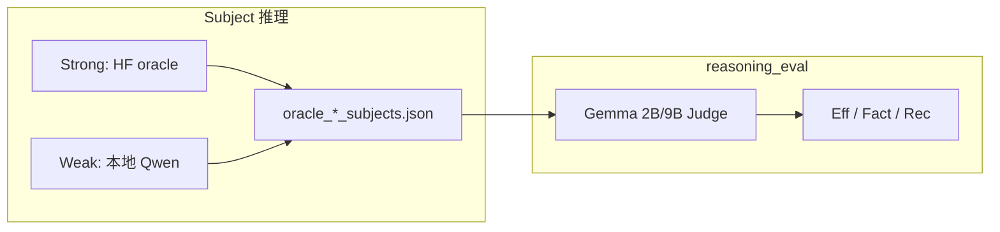

# Stage 1 实验总报告：Demo 数据集推理评估

> **环境**：GPU-P100-2（2× P100 16GB）  
> **数据**：`demo_diagnosis_100.json` / `demo_treatment_100.json`（各 100 例，seed=42）  
> **更新**：2026-06-13（Diagnosis reasoning_eval 完整；Treatment 进行中）

---

## 1. 实验目标

| 编号 | 内容 |
|------|------|
| **Stage 1** | 100 diagnosis + 100 treatment demo，跑通全流程 |
| **2.1** | **Strong** = o3-mini、deepseek-r1；**Weak** = qwen3-8b、qwen3-14b |
| **2.2** | Gemma 2B/9B reasoning_eval 三指标，**direct** / **inference_augmented** 两组 |

**核心问题**：reasoning_eval 能否区分 Strong/Weak？aug 组是否提升 Completeness？

---

## 2. Demo 数据

配置见 `data/MedRBench/demo_stage1_manifest.json`（`scripts/data/build_demo_subset.py`，seed=42）。

| 任务 | 全量池 | Demo | 抽样要点 |
|------|--------|------|----------|
| Diagnosis | 957（491 rare） | 100 | test35 全纳入 + 65 例分层补 rare |
| Treatment | 496（165 rare） | 100 | 分层随机，无 test35 |

| 维度 | Diagnosis 100 | Treatment 100 |
|------|---------------|---------------|
| Rare 占比 | 65%（全库 51%） | 51%（全库 33%） |

Treatment demo rare 占比偏高，解读 aggregate 时需知偏复杂病例。

---

## 3. 实验设计

**指标**（无 web search）：Efficiency（有效步占比）、Factuality（步内事实正确率）、Completeness（GT 推理覆盖 recall）。

**两组**：direct = 仅 `<step N>`；inference_augmented = 推理链 + `Final model inference: {Answer}`。

**Strong 推理来源**：[HuggingFace MedRbench-Inference-Results](https://huggingface.co/datasets/Henrychur/MedRbench-Inference-Results)（diagnosis → `oracle_diagnosis.json`；treatment → `data/InferenceResults/treatment_planning.json`）。

---

## 4. 完成度

### Diagnosis

| 模块 | 状态 |
|------|------|
| Subject（o3 / deepseek / qwen3-8b） | ✅ 100/100 |
| qwen3-14b | ❌ 0/100（环境阻塞） |
| Gemma-2B reasoning_eval | ✅ 3 模型 × 2 组 |
| Gemma-9B reasoning_eval | ✅ 3 模型 × 2 组（600 case） |

### Treatment（进行中）

| 模块 | 状态 |
|------|------|
| Strong（o3 / deepseek） | ✅ `treatment_planning.json` + subjects 合并 |
| qwen3-8b 推理 | 待做 |
| Gemma-2B reasoning_eval | 进行中（如 o3 100/100；deepseek direct 部分完成） |

### Gemma Scope（辅助，1–5 分）

见 §6.4；9B 饱和，2B 仅作参考。

---

## 5. 结果：Diagnosis（Gemma-2B-it）

### 5.1 聚合均值

| Subject | 组别 | Eff | Fact | Rec |
|---------|------|-----|------|-----|
| o3-mini | direct | 99.3% | 93.4% | 78.5% |
| | aug | 98.9% | 92.9% | 79.7% |
| deepseek-r1 | direct | 99.7% | 92.4% | 78.2% |
| | aug | 99.6% | 92.1% | **80.7%** |
| qwen3-8b | direct | 99.6% | 92.2% | 78.8% |
| | aug | 99.1% | 92.2% | **80.7%** |

**组间**：aug 使 Rec **+1.2 ~ +2.5 pp**，Eff/Fact 几乎不变 → 两组设计 **有效**。  
**模型间**：均值差 **<1.5 pp**，Eff ~99% 饱和 → **无法区分 Strong/Weak**。

#### 组间效应（direct → aug）

| Subject | Eff Δ | Fact Δ | Rec Δ |
|---------|-------|--------|-------|
| o3-mini | −0.4 pp | −0.5 pp | **+1.2 pp** |
| deepseek-r1 | −0.1 pp | −0.3 pp | **+2.5 pp** |
| qwen3-8b | −0.5 pp | 0.0 pp | **+1.8 pp** |

### 5.2 逐 case（direct，三模型）

| 指标 | spread median | spread≥0.2 |
|------|---------------|------------|
| Eff | 0.000 | 3/100 |
| Fact | 0.143 | 22/100 |
| Rec | 0.154 | **39/100** |

#### 三模型 Rec 相关性（Pearson r）

| 模型对 | r |
|--------|---|
| o3 ↔ deepseek | 0.476 |
| o3 ↔ qwen | 0.424 |
| deepseek ↔ qwen | 0.425 |

#### qwen vs o3 Completeness（差距 ≥0.2）

| 方向 | case 数 |
|------|---------|
| qwen **低于** o3 | 13/100 |
| qwen **高于** o3 | 11/100 |

#### 典型高分差 case（direct）

| Case ID | 特征 |
|---------|------|
| PMC11395317 | Comp spread=0.83；qwen Rec=0.17，o3=0.67 |
| PMC11452711 | qwen Rec=0.33，o3/deepseek=1.00 |
| PMC11364916 | qwen=1.00，o3=0.25（反例） |

- Completeness 方差约 **63% 来自 case 难度**，模型间差距与 case 难度同量级。
- 三模型 Rec **中等正相关**（同难同易），非强>弱；qwen/o3 大差距 **对称**，无 stable weak 信号。

---

## 6. 结果：Diagnosis（Gemma-9B-it）

### 6.1 Direct 三模型

| Subject | Eff | Fact | Rec |
|---------|-----|------|-----|
| o3-mini | 96.4% | 96.0% | 94.8% |
| deepseek-r1 | 98.3% | 95.5% | **91.5%** |
| qwen3-8b | 97.6% | 95.4% | **96.4%** |

相对 2B：Rec **+13~18 pp**；**qwen（weak）Rec 最高、deepseek 最低**，与预设相反。

#### Rec 逐 case 配对（direct）

| 对比 | 均值差 | 前者更高 case 数 |
|------|--------|------------------|
| qwen − deepseek | **+4.9 pp** | 34/100 |
| o3 − deepseek | +3.3 pp | 28/100 |
| qwen − o3 | +1.7 pp | 17/100 |

| 角色 | o3 | deepseek | qwen |
|------|-----|----------|------|
| Rec **最低**频次 | 69 | **83** | 56 |
| Rec **最高**频次 | 81 | 65 | **91** |

### 6.2 aug 组间效应

| Subject | Eff Δ | Fact Δ | Rec Δ |
|---------|-------|--------|-------|
| o3-mini | **−7.3 pp** | −0.9 pp | **+1.6 pp** |
| deepseek-r1 | **−10.9 pp** | −1.2 pp | **+1.7 pp** |
| qwen3-8b | **−7.6 pp** | −1.0 pp | −0.3 pp |

#### direct vs aug 聚合 Eff

| Subject | direct | aug |
|---------|--------|-----|
| o3-mini | 96.4% | **89.2%** |
| deepseek-r1 | 98.3% | **87.4%** |
| qwen3-8b | 97.6% | **89.9%** |

aug 主要信号在 **Efficiency 下降**；Rec 对 o3/deepseek 略升（+1.6~1.7 pp）。aug 后三模型 Eff 收敛至 **87~90%**。

### 6.3 逐 case 分差（三模型 max−min）

| 指标 | 2B direct | 9B direct | 9B aug |
|------|-----------|-----------|--------|
| Eff spread median | 0.000 | 0.000 | **0.143** |
| Eff spread≥0.2 | 3/100 | 9/100 | **18/100** |
| Rec spread median | 0.154 | 0.050 | 0.000 |
| Rec spread≥0.2 | **39/100** | 10/100 | 11/100 |

#### qwen vs o3 Rec 差距 ≥0.2

| 方向 | 2B direct | 9B direct | 9B aug |
|------|-----------|-----------|--------|
| qwen **低于** o3 | 13/100 | **1/100** | 2/100 |
| qwen **高于** o3 | 11/100 | **2/100** | 3/100 |

#### 9B vs 2B Judge（direct，同 100 case）

| Subject | Eff Δ(9B−2B) | Fact Δ | Rec Δ | Rec 相关 r |
|---------|--------------|--------|-------|------------|
| o3-mini | −2.8 pp | +2.6 pp | **+16.3 pp** | 0.35 |
| deepseek-r1 | −1.4 pp | +3.1 pp | **+13.3 pp** | 0.43 |
| qwen3-8b | −2.1 pp | +3.2 pp | **+17.6 pp** | **0.07** |

9B 更慷慨，**不能与 2B 混比**；9B 在 **aug 的 Eff** 上更有区分度。

#### 9B 典型高分差 case（direct）

| Case ID | 特征 |
|---------|------|
| PMC11439974 | deepseek Rec=0.50，qwen=1.00 |
| PMC11470589 | deepseek Fact=0.40，qwen Fact=1.00 |
| PMC11418098 | deepseek Rec=0.50，o3/qwen=0.90/0.70 |

#### 9B direct 方差分解

| 指标 | between-case | within-case（模型） |
|------|--------------|---------------------|
| Efficiency | 52.6% | 71.3% |
| Factuality | 50.2% | 74.9% |
| Completeness | **63.3%** | 55.5% |

### 6.4 Gemma Scope 辅助评估（1–5 分）

| Judge | Subject | direct | sae_aug | Δ |
|-------|---------|--------|---------|---|
| 2B (reparsed) | deepseek-r1 | 4.65 | 4.07 | −0.58 |
| 2B (reparsed) | o3-mini | 4.93 | — | — |
| 2B (reparsed) | qwen3-8b* | 4.71 | 4.20 | −0.51 |
| **9B** | 三模型 | **5.00** | **5.00** | 0.00 |

\* qwen 2B direct 仅 7/100 parse 成功。9B Scope **完全饱和**，不宜用于分层。

---

## 7. 综合结论

| 目标 | 结论 |
|------|------|
| Demo 流程（diagnosis） | ✅ |
| aug 组设计 | ✅ 2B 提 Rec；9B 降 Eff |
| Strong/Weak 分层 | ❌ 2B/9B 均不能；9B 上 weak 反而 Rec 更高 |
| Accuracy | ⏳ 未做；reasoning ≠ 诊断/治疗对错 |

**要点**：

1. reasoning_eval 评 **推理链质量**，不是最终 Answer 对错。
2. Judge 选择影响极大；case 难度常大于模型差异。
3. deepseek 在 9B Rec 上系统性偏低，待 Accuracy 交叉解释。
4. Stage 2 优先：**Accuracy eval**，再按对错分层看 reasoning；并行推进 **Treatment** 全流程。

---

## 8. 产出索引

| 路径 | 说明 |
|------|------|
| `data/MedRBench/demo_*_100.json` | Demo 病例 |
| `data/InferenceResults/treatment_planning.json` | Treatment 官方推理（496） |
| `data/Stage1/oracle_{diagnosis,treatment}_subjects.json` | 合并 subject |
| `data/Stage1/reasoning_eval/{diagnosis,treatment}_gemma-{2b,9b}-it_*.json` | 评估结果 |
| `scripts/stage1/` | 推理、评估、分析脚本 |

---

*Diagnosis 数值来自 100 例 × 3 模型完整 run；分析脚本见 `scripts/stage1/`。*
