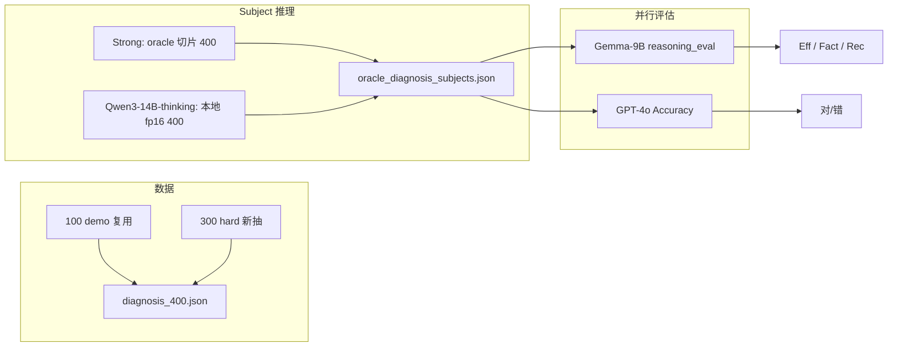
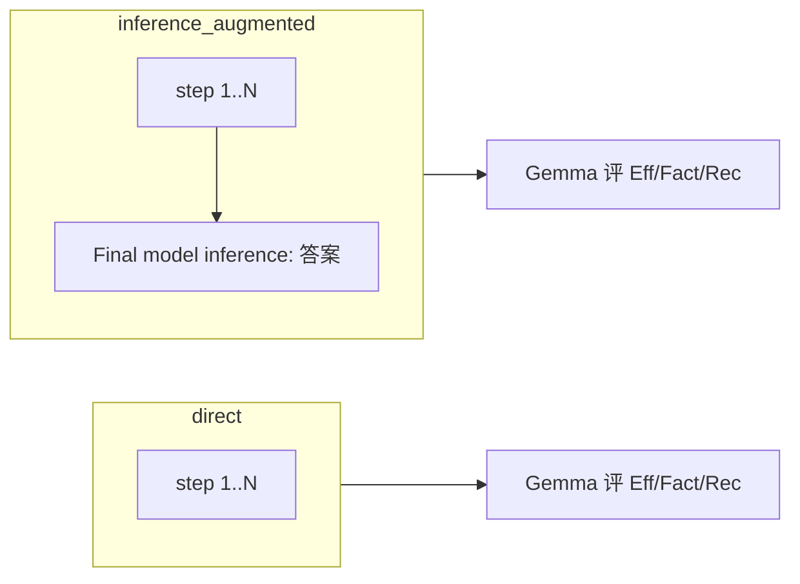
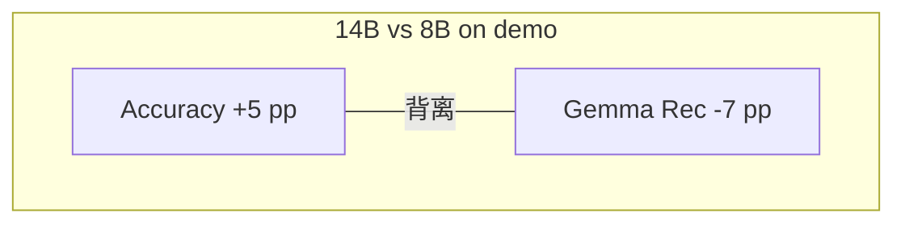
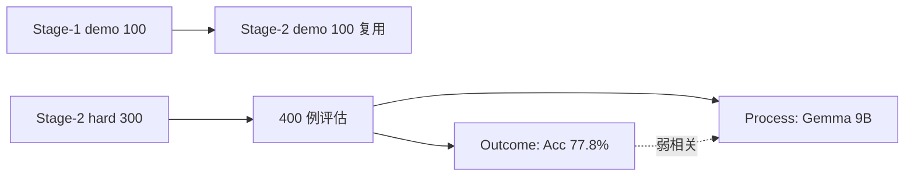

# Stage 2 实验总报告：Hard 子集 + Qwen3-14B-thinking 扩展评估

> **环境**：GPU-A800（8× A800 80GB；推理 4 卡 fp16，Gemma 3 卡并行）  
> **数据**：`diagnosis_400.json` = 100 demo（复用 Stage-1）+ 300 hard（seed=42）  
> **Subject**：本阶段本地新跑 **qwen3-14b-thinking**；o3-mini / deepseek-r1 从 oracle 切片复用  
> **Judge**：Gemma-9B-it（reasoning_eval）；GPT-4o via xiaoai.plus（Diagnosis Accuracy，原设计 gpt-5 不可用）  
> **更新**：2026-06-24（推理 + Gemma + Accuracy 全部 400/400 完成）

## 目录

- [1. 实验目标](#sec-1)
- [2. Stage-2 数据](#sec-2)
- [3. 实验设计](#sec-3)
- [4. 完成度](#sec-4)
- [5. Diagnosis Accuracy（GPT-4o）](#sec-5)
- [6. 结果：Gemma-9B-it（qwen3-14b-thinking）](#sec-6)
  - [6.1 聚合均值](#sec-6-1)
  - [6.2 aug 组间效应](#sec-6-2)
    - [6.2.1 机制：为何 Eff↓、Rec↑](#sec-6-2-1)
    - [6.2.2 aug 能否帮助预测诊断对错](#sec-6-2-2)
  - [6.3 Accuracy × reasoning 分层](#sec-6-3)
  - [6.4 与 Stage-1 qwen3-8b 对比](#sec-6-4)
  - [6.5 错例与典型 case](#sec-6-5)
- [7. 综合结论](#sec-7)
- [8. 产出索引](#sec-8)

---

<a id="sec-1"></a>
## 1. 实验目标

| 编号 | 内容 |
|------|------|
| **Stage 2** | 在 Stage-1 demo 100 基础上，追加 **300 hard** 病例，共 400 例 diagnosis |
| **2.1** | **Strong**（o3-mini、deepseek-r1）demo 100 **不重跑**；本阶段本地仅跑 **qwen3-14b-thinking** 全 400 |
| **2.2** | Gemma-9B reasoning_eval（**不用 2B**），direct / inference_augmented 两组 |
| **2.3** | GPT Judge 对 400 例做 **Diagnosis Accuracy**（最终诊断语义对错） |

**核心问题**：

1. Hard 300 是否显著拉低 weak 模型 outcome？
2. qwen3-14b-thinking 相对 qwen3-8b 是否在 **Accuracy** 与 **reasoning_eval** 上同步提升？
3. Stage-1 观察到的「reasoning 与 outcome 背离」在 14B-thinking + hard 集上是否延续？

---

<a id="sec-2"></a>
## 2. Stage-2 数据

配置见 `data/MedRBench/stage2_manifest.json`（`scripts/stage1/build_stage2_hard_subset.py`，seed=42）。

| 维度 | 数值 |
|------|------|
| 全量 diagnosis 池 | 957（491 rare） |
| Demo（复用 Stage-1） | 100 |
| Hard（新抽） | 300 |
| 合并 | **400** |
| Hard 抽样依据 | Stage-1 demo 上 o3/deepseek/qwen 的 acc + reasoning 难度加权 |

| 子集 | Rare 占比（400 内） |
|------|---------------------|
| 全部 400 | 201/400 = **50.3%** |
| Demo 100 | 与 Stage-1 相同（65% rare） |
| Hard 300 | 约 45% rare |

Hard 子集按 Stage-1 表现偏「难」，但 **Gemma reasoning 三指标在 demo/hard 上几乎无差**（见 §6.1），说明 process 指标对 case 难度不敏感，而 outcome（Accuracy）敏感。

---

<a id="sec-3"></a>
## 3. 实验设计



**指标**（无 web search）：Efficiency、Factuality、Completeness（recall）；Accuracy 为 GPT 对 `diagnosis_results` 的语义等价判断。

**两组 scoring**（`scripts/stage1/stage1_subject_text.py`）：

| 组别 | 评什么 |
|------|--------|
| **direct** | 仅 `<step N>` 推理步 |
| **inference_augmented** | 推理步 + 末尾追加 `Final model inference: {最终诊断}` |

Accuracy **与组别无关**（始终评 subject 最终答案）；aug 只改变 Gemma 对 **推理链** 的三指标。

**并行策略（A800）**：

| 阶段 | 并行 |
|------|------|
| Qwen 推理 | 4 GPU shard（0/1/2/7），fp16 |
| Gemma eval | 3 GPU shard（0/1/2），全卡 fp16、无 CPU offload |
| GPT Accuracy | 16 API worker，不占 GPU |

**Strong 推理来源**：与 Stage-1 相同，[HuggingFace MedRbench-Inference-Results](https://huggingface.co/datasets/Henrychur/MedRbench-Inference-Results) → `oracle_diagnosis.json` 按 manifest 切片至 400。

---

<a id="sec-4"></a>
## 4. 完成度

| 模块 | 状态 |
|------|------|
| Hard 300 + 合并 400 manifest | ✅ |
| Subject：o3-mini / deepseek-r1（400，复用） | ✅ |
| Subject：qwen3-14b-thinking 推理 | ✅ **400/400** |
| Gemma-9B reasoning_eval · direct | ✅ **400/400** |
| Gemma-9B reasoning_eval · inference_augmented | ✅ **400/400** |
| Diagnosis Accuracy（GPT-4o Judge） | ✅ **400/400** |

---

<a id="sec-5"></a>
## 5. Diagnosis Accuracy（GPT-4o）

**方法**：`oracle_diagnose_accuracy.py`（`eval_config.env` → xiaoai.plus，`EVAL_MODEL=gpt-4o`）；结果见 `data/Stage2/acc_results_gpt/qwen3-14b-thinking/`。

### 5.1 总体与子集

| 子集 | 正确 | Accuracy |
|------|------|----------|
| **全部 400** | 311 | **77.8%** |
| Demo 100 | 91 | **91.0%** |
| Hard 300 | 220 | **73.3%** |
| Rare（201） | 160 | 79.6% |
| Non-rare（199） | 151 | 75.9% |

Hard 比 demo **低 17.7 pp**；89 个错例中 **80 个（90%）来自 hard 300** → hard 抽样有效。

### 5.2 Demo 100 与 Stage-1 三模型对比

| Subject | Demo Accuracy（100 例） |
|---------|------------------------|
| deepseek-r1 | **95%** |
| o3-mini | 92% |
| **qwen3-14b-thinking**（本阶段） | **91%** |
| qwen3-8b（Stage-1） | 86% |

**解读**：

- **14B-thinking 在 demo 上比 8B 高 5 pp**（91% vs 86%），接近 o3-mini，仍低于 deepseek-r1。
- 外推到 400 例：整体 77.8% 主要由 hard 300 的 73.3% 拉低。
- Rare / non-rare 差距小（3.7 pp），hard 难度不 solely 来自 rare 标签。

---

<a id="sec-6"></a>
## 6. 结果：Gemma-9B-it（qwen3-14b-thinking）

<a id="sec-6-1"></a>
### 6.1 聚合均值

| 组别 | 子集 | Eff | Fact | Rec | Acc（同子集） |
|------|------|-----|------|-----|---------------|
| **direct** | All 400 | **97.8%** | 93.2% | 89.2% | 77.8% |
| | Demo 100 | 98.2% | 94.5% | 89.2% | 91.0% |
| | Hard 300 | 97.7% | 92.8% | 89.2% | 73.3% |
| **inference_augmented** | All 400 | 88.4% | 91.8% | **91.0%** | 77.8% |
| | Demo 100 | 88.0% | 94.1% | 91.7% | 91.0% |
| | Hard 300 | 89.5% | 92.3% | 91.6% | 73.3% |

**要点**：

- Gemma 三指标在 demo / hard 间 **几乎平坦**（Rec 均 ~89% direct），与 Accuracy 对 hard 的敏感性 **形成对比**。
- Rec 标准差：demo 0.141、hard 0.147（case 内方差仍主要来自个体 case，非子集标签）。

<a id="sec-6-2"></a>
### 6.2 aug 组间效应（paired 400）

| 指标 | direct | aug | Δ（aug−direct） |
|------|--------|-----|-----------------|
| Efficiency | 97.8% | 88.4% | **−8.7 pp** |
| Factuality | 93.2% | 91.8% | −1.4 pp |
| Completeness | 89.2% | 91.0% | **+2.4 pp** |

#### 逐 case Eff 下降分布

| 统计量 | 值 |
|--------|-----|
| 均值 ΔEff（direct−aug） | 8.7 pp |
| 中位 ΔEff | 12.2 pp |
| case 数 ΔEff ≥ 10 pp | **201/400** |

与 Stage-1 一致：append Final Answer 后 **Efficiency 系统性下降**，**Completeness 略升** → aug 组设计在 Stage-2 **依然有效**。

<a id="sec-6-2-1"></a>
#### 6.2.1 机制：为何 Eff↓、Rec↑、Fact 略↓



| 现象 | Δ（aug−direct） | 机制解释 |
|------|-----------------|----------|
| **Eff ↓** | **−8.7 pp** | 多一步 `Final model inference`；Gemma 常将其标为 **Citation / Redundancy**（与前面推理重复），拉低「有效推理步」占比。201/400 case 的 Eff 单例下降 ≥ 10 pp，中位降约 12 pp |
| **Rec ↑** | **+2.4 pp** | 最后一步 **显式写出最终诊断**，Completeness 的 hit-check 更容易算作覆盖了 GT 推理中的 **结论段** |
| **Fact 略 ↓** | −1.4 pp | 多一步即多一次事实性判定；若最终答案与前面某步表述不一致，该步可能被扣分 |

与 Stage-1 qwen3-8b 的 aug 效应对照：

| 指标 | Stage-1 8B · aug−direct | Stage-2 14B · aug−direct |
|------|-------------------------|--------------------------|
| Eff | −7.6 pp | **−8.7 pp** |
| Rec | −0.3 pp | **+2.4 pp** |

14B-thinking 上 **aug 对 Rec 的正向效果更明显**，可能与 thinking 链更长、显式 Final 步对 GT 覆盖的补充更大有关。

**重要**：aug **不改变** Diagnosis Accuracy（仍为 311/400）；只改变 Gemma 对 process 的打分。

<a id="sec-6-2-2"></a>
#### 6.2.2 aug 能否帮助「用 reasoning 猜对错」

若把 Gemma 三指标当作 outcome 的 proxy，direct 与 aug **分工不同**：

| 分组 | 答对 vs 答错 · Rec 差 | 答对 vs 答错 · Eff 差 | 答对 vs 答错 · Fact 差 |
|------|----------------------|----------------------|------------------------|
| **direct** | **+9.0 pp** | +1.1 pp（几乎无效） | **+6.3 pp** |
| **aug** | +6.6 pp | **+4.7 pp** | **+6.1 pp** |

| 组别 | 更适合做什么 |
|------|--------------|
| **direct** | **Rec / Fact** 更能区分诊断对错；Eff 在 ~98% **饱和**，几乎无分层信号 |
| **aug** | **Eff** 开始有一点分层（错例 Eff 更低）；Rec 仍有用但 **弱于 direct**（+6.6 pp vs +9.0 pp） |

Pearson r（acc × Rec）：direct **0.26** · aug 0.21——用 Rec 猜对错时 **direct 略优**；若关心「整条链（含结论步）是否简洁」，可看 aug 的 Eff 差 +4.7 pp。

**使用建议**（与 Stage-1 §6.3 一致）：

- 评 **纯推理过程** → 看 **direct**
- 评 **推理是否把最终结论纳入评估视野** → 看 **aug**（Rec↑ 但 Eff↓）
- 评 **最终对不对** → 只看 **Accuracy**，与 direct/aug 无关

<a id="sec-6-3"></a>
### 6.3 Diagnosis Accuracy × reasoning_eval 分层

本节在 §6.2.2 基础上给出完整分层表（400 例，GPT-4o Accuracy × Gemma-9B reasoning）。

#### Gemma-9B · direct · 按对错分层（400 例）

| 分层 | n | Eff | Fact | Rec |
|------|---|-----|------|-----|
| 回答对 | 311 | 98.1% | 94.6% | **91.2%** |
| 回答错 | 89 | 97.0% | 88.4% | **82.2%** |
| 差值（对−错） | | +1.1 pp | **+6.3 pp** | **+9.0 pp** |

#### Gemma-9B · inference_augmented · 按对错分层

| 分层 | n | Eff | Fact | Rec |
|------|---|-----|------|-----|
| 回答对 | 311 | 90.2% | 94.1% | **93.1%** |
| 回答错 | 89 | 85.4% | 88.0% | **86.5%** |
| 差值（对−错） | | **+4.7 pp** | **+6.1 pp** | **+6.6 pp** |

#### 点二列相关（acc 0/1 × Rec）

| 组别 | Pearson r（acc × Rec） |
|------|------------------------|
| direct | **0.26** |
| inference_augmented | 0.21 |

**解读**（对照 Stage-1 §6.3；aug 机制见 §6.2.1–§6.2.2）：

- **Rec 与对错正相关**：direct 错例 Rec 82.2%，差 **+9.0 pp**——信号强于 Stage-1 qwen3-8b（direct Rec 差仅 +0.1 pp）。
- **Factuality 有中等信号**：两组错例 Fact 均低 ~6 pp（Stage-1 qwen direct 无此信号）。
- **direct 上 Eff 几乎不能预测对错**（+1.1 pp）；**aug 上 Eff 有弱信号**（+4.7 pp），因 Final 步拉低错例整条链的有效步占比。
- **direct 的 Rec 分层强于 aug**（+9.0 vs +6.6 pp）；若要用 reasoning  proxy 预测 outcome，**优先 direct 的 Rec/Fact**。
- 89 错例中仅 **6 例 direct Rec < 0.5** → 大量 **「推理覆盖度中等偏高但结论错」** 案例。

复现：

```bash
python scripts/stage1/analyze_stage2_results.py
python scripts/stage1/analyze_gemma9b_by_accuracy.py  # 需改路径为 Stage-2 时可扩展
```

<a id="sec-6-4"></a>
### 6.4 与 Stage-1 qwen3-8b 对比

#### Demo 100 · Gemma-9B direct

| Subject | Eff | Fact | Rec |
|---------|-----|------|-----|
| qwen3-8b（Stage-1） | 97.6% | 95.4% | **96.4%** |
| qwen3-14b-thinking（Stage-2 demo） | 98.2% | 94.5% | **89.2%** |
| qwen3-14b-thinking（Stage-2 hard） | 97.7% | 92.8% | **89.2%** |

| 对比 | 数值 |
|------|------|
| Demo Rec：14B − 8B | **−7.2 pp** |
| Demo Rec Pearson r（同 100 case） | **0.68** |
| Demo Accuracy：14B − 8B | **+5 pp**（91% vs 86%） |

**悖论延续并加强**：

- 14B-thinking **最终诊断更准**，但 Gemma **Completeness 更低**。
- 同 100 demo case 上 Rec 仍 **中等正相关（r=0.68）**——排序部分一致，但 14B 系统性更低。
- 可能机制：thinking 链更长/结构不同，Gemma 按 GT 步覆盖计分更严；或最终 answer 纠正了推理链未覆盖的分支。

#### Outcome vs Process（400 例）



<a id="sec-6-5"></a>
### 6.5 错例与典型 case

**错例结构（n=89）**

| 特征 | 数量 |
|------|------|
| 来自 hard 300 | 80（90%） |
| direct Rec ≥ 1.0 仍错 | 10 |
| direct Rec < 0.5 | 6 |

#### 高 Rec 但诊断错（direct Rec=1.0，部分）

| Case ID | Eff | Fact | 子集 | 说明 |
|---------|-----|------|------|------|
| PMC11489070 | 1.00 | 1.00 | hard | 推理逐步满分，最终诊断仍错 |
| PMC11416184 | 0.80 | 1.00 | hard | 同上 |
| PMC11615159 | 1.00 | 1.00 | hard | 同上 |
| PMC11446496 | 1.00 | 1.00 | demo | demo 中少数「全满分但错」 |
| PMC11459459 | 1.00 | 0.25 | hard | Rec 高但 Fact 低，仍答错 |

#### 低 Rec 且诊断错（direct Rec 最低几例）

| Case ID | Rec |
|---------|-----|
| PMC11512724 | 0.33 |
| PMC11590343 | 0.33 |
| PMC11637879 | 0.33 |
| PMC11541951 | 0.38 |
| PMC11642678 | 0.40 |

低 Rec 错例是 **少数**；多数错例属于「推理看似完整 → 结论仍偏」。

---

<a id="sec-7"></a>
## 7. 综合结论

| 目标 | 结论 |
|------|------|
| Stage-2 全流程（400 例） | ✅ 推理 + Gemma + Accuracy 全部完成 |
| Hard 300 难度 | ✅ Acc 73.3% vs demo 91%；90% 错例来自 hard |
| qwen3-14b-thinking vs 8B（demo） | ✅ Acc **+5 pp**；Gemma Rec **−7 pp** |
| aug 组设计 | ✅ Eff −8.7 pp、Rec +2.4 pp；机制见 §6.2.1 |
| aug 预测 outcome | ⚠️ Eff 有弱信号（+4.7 pp）；Rec 弱于 direct（§6.2.2） |
| reasoning 预测 outcome（direct） | ⚠️ Rec/Fact 有弱–中等信号（r≈0.26）；Eff 饱和无效 |
| Strong/Weak 在 400 上完整对比 | ⏸️ 本报告仅 qwen3-14b-thinking 全 400；o3/deepseek 全 400 acc 待跑 |

**要点**：

1. **Hard 子集主要影响 outcome，不 much 影响 Gemma process 分数**——解读 400 例 aggregate 时必须分子集。
2. **14B-thinking 改善最终诊断（77.8% / demo 91%），但不改善 Gemma Completeness**——与 Stage-1「Rec 高 Acc 低」同一类背离，换更大 thinking 模型仍存在。
3. **Accuracy × reasoning 交叉在 14B 上比 8B 更有信号**（direct Rec 差 +9 pp vs +0.1 pp），但仍是 **弱相关**；**aug 不提升 Acc**，只改变 process 指标的含义（§6.2）。
4. **direct vs aug**：direct 适合 Rec/Fact 分层；aug 适合观察「含结论步」时的 Eff 变化——二者 **不可混比 aggregate**。
5. **Judge 备注**：Accuracy 实际为 **GPT-4o**（xiaoai 无 gpt-5），与 Stage-1 一致，可与 Stage-1 直接对比。

### Stage-1 → Stage-2 对照摘要

| 维度 | Stage-1（demo 100 × 3 模型） | Stage-2（400 × qwen3-14b-thinking） |
|------|------------------------------|----------------------------------------|
| 数据 | 100 demo | 100 demo + 300 hard |
| Weak 模型 | qwen3-8b | qwen3-14b-thinking |
| Gemma | 2B + 9B | **仅 9B** |
| Acc Judge | GPT-4o | GPT-4o |
| Weak Acc | 86% | 91%（demo）/ 77.8%（400） |
| Weak 9B Rec direct | 96.4% | 89.2%（400） |

### 后续可选

1. 对 o3-mini / deepseek-r1 跑 **全 400 Accuracy**（subjects 已有，仅 API 评估）。
2. 89 错例人工 / case study 报告（高 Rec 错例 vs 低 Rec 错例）。
3. Hard 300 单独与 Stage-1 同 case 的 strong 模型对比（若 strong 在 hard 上有历史输出）。



---

<a id="sec-8"></a>
## 8. 产出索引

| 路径 | 说明 |
|------|------|
| `data/MedRBench/stage2_manifest.json` | 400 case ID、demo/hard 划分 |
| `data/MedRBench/hard_diagnosis_300.json` | Hard 子集 GT |
| `data/MedRBench/diagnosis_400.json` | 合并 400 例 GT |
| `data/Stage2/inference/qwen3-14b-thinking_diagnosis.json` | 14B 推理输出 |
| `data/Stage2/oracle_diagnosis_subjects.json` | o3 / deepseek / 14B subjects |
| `data/Stage2/reasoning_eval/diagnosis_gemma-9b-it_qwen3-14b-thinking_*.json` | Gemma-9B reasoning_eval |
| `data/Stage2/acc_results_gpt/qwen3-14b-thinking/PMC*.json` | GPT-4o Accuracy |
| `scripts/stage1/run_stage2_a800_parallel.sh` | A800 并行流水线 |
| `scripts/stage1/analyze_stage2_results.py` | 本报告聚合统计 |
| `scripts/stage1/analyze_stage2_extended.py` | 扩展相关 / 典型 case |
| `docs/reports/STAGE1_EXPERIMENT_REPORT.md` | Stage-1 对照报告 |

---

*数值来自 qwen3-14b-thinking × 400 完整 run；复现见 `scripts/stage1/analyze_stage2_results.py`。*
