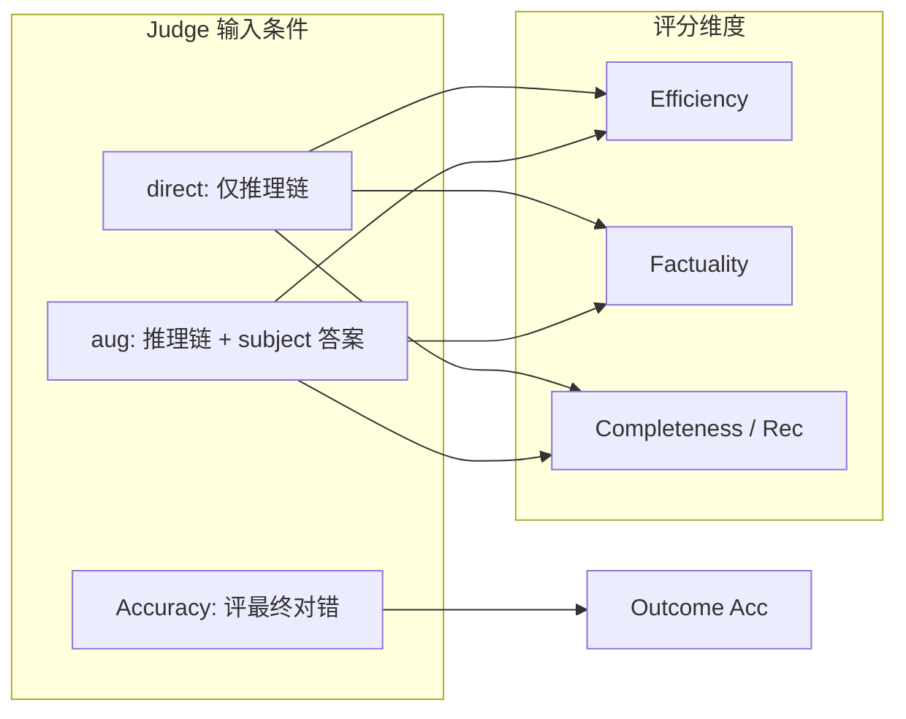

# Stage 2 实验报告：答案诱导偏差 · 400 例扩展验证

> **课题**：医学长链诊断推理中 LLM 评审的**答案诱导偏差**（answer-induced bias）  
> **问题**：Judge 是否真正评价推理**过程**，还是被**最终诊断答案**牵引？  
> **数据**：100 demo + 300 hard · **Subject**：qwen3-14b-thinking（本地 fp16）+ o3-mini / deepseek-r1（oracle）  
> **Judge**：**Gemma-9B**（reasoning_eval + Diagnosis Accuracy）· GPT-4o Acc 作对照  
> **状态**：三模型 reasoning + Acc-Gemma 均 400/400 完成（2026-06-26）  
> **框架**：[MedR-Bench](https://www.nature.com/articles/s41467-025-64769-1) Reasoning Evaluator（Efficiency / Factuality / Completeness）  
> 复现：`python scripts/stage1/analyze_stage2_all_models.py` · 核对：`python scripts/stage1/verify_stage2_report.py`

## 目录

- [400 例总览](#sec-summary)
- [1. 研究定位与实验设计](#sec-1)
- [2. 分项解读](#sec-2)
- [3. 与 Stage-1 / 论文](#sec-3)
- [4. 综合结论](#sec-4)
- [5. 后续方向](#sec-5)
- [6. 产出索引](#sec-6)

---

## 400 例总览

**任务**：oracle diagnosis · **n = 400**（demo 100 + hard 300，75% hard）

### Outcome：Diagnosis Accuracy（Gemma-9B · 评最终答案对错）

| 模型 | 400 | Demo 100 | Hard 300 |
|------|-----|----------|----------|
| **deepseek-r1** | **84.2%** (337/400) | **97%** | 80.0% |
| **qwen3-14b-thinking** | **83.8%** (335/400) | 92% | **81.0%** |
| o3-mini | 78.5% (314/400) | 91% | 74.3% |

### Outcome 对照：GPT-4o Acc（附录）

| 模型 | 400 | Demo | Hard | Gemma−GPT Δ |
|------|-----|------|------|-------------|
| deepseek-r1 | 81.5% | 96% | 76.7% | +2.8 pp |
| qwen3-14b-thinking | 77.8% | 91% | 73.3% | **+6.0 pp** |
| o3-mini | 77.5% | 92% | 72.7% | +1.0 pp |

Judge 一致率（逐 case 同判对错）：deepseek **91.8%** · o3 **90.0%** · 14B **88.5%**。

### Process：Gemma-9B reasoning_eval（条件 A · direct · 400 均值）

| 模型 | Eff | Fact | Rec | aug Δ Eff | aug Δ Rec |
|------|-----|------|-----|-----------|-----------|
| deepseek-r1 | **98.5%** | 92.6% | 90.3% | −9.3 pp | +1.4 pp |
| o3-mini | 96.3% | **95.4%** | **93.4%** | −5.8 pp | +1.1 pp |
| qwen3-14b-thinking | 97.8% | 93.2% | 89.2% | −8.7 pp | +2.4 pp |

### 过程–结局关联（Gemma Acc × direct Rec · 400）

| 模型 | Rec 差（对−错） | r(acc, Rec) |
|------|----------------|-------------|
| qwen3-14b-thinking | **+10.4 pp** | **0.26** |
| deepseek-r1 | +6.1 pp | 0.17 |
| o3-mini | +5.7 pp | 0.19 |

**四句话结论（答案诱导视角）**：

1. **追加 subject 最终诊断（aug）会系统性改变 process 分**：Eff 降 6–9 pp、Rec 升 1–2 pp——Judge 评分**随答案是否暴露而变**，非纯过程评价。
2. **过程分与结局分（Acc）严重背离**：o3 Rec **最高**（93%）Acc **最低**（78.5%）；r(acc, Rec) 仅 0.17–0.26——高过程分**不能保证**诊断正确。
3. **过程分不反映病例难度**：demo→hard Acc 跌 11–17 pp，Eff/Rec 几乎不变——Judge **对「难不难」不敏感**，却对**答案呈现方式**敏感（见 §2.4）。
4. **错例典型模式**：Acc 错但 Rec 高（88% 错例来自 hard）——符合「结论牵引过程评价」的诱导偏差假设。

---

## 1. 研究定位与实验设计

### 1.1 研究问题

基于 MedR-Bench（1453 例结构化临床病例），本课题考察：在不同 Judge 输入条件下，LLM 对医学长链推理在 **Efficiency、Factuality、Completeness**（及后续扩展的 Evidence / Safety）等维度上的评分是否发生**系统性偏移**——即验证 Judge 是在评**推理过程**，还是被**最终诊断答案**诱导（answer-induced bias）。

### 1.2 Stage-2 在课题中的角色

Stage-1（demo 100）已跑通 direct / inference_augmented 两组；Stage-2 在 **400 例**（含 300 hard）上扩展，并统一 Gemma-9B 为 reasoning + Acc judge，检验诱导偏差是否在更难子集上仍成立。

### 1.3 输入条件对照（本阶段已实现 vs 待做）

| 条件 ID | Judge 可见输入 | Stage-2 状态 | 对应代码组 |
|---------|---------------|-------------|-----------|
| **A — Process-only** | 病例摘要 + 推理链（`<step N>`） | ✅ 400×3 模型 | `direct` |
| **A′ — Process + Subject DX** | A + subject 自报最终诊断 | ✅ 400×3 模型 | `inference_augmented` |
| **B — Process + Correct DX** | A + GT 正确诊断 | ⬜ 待做 | 需改 prompt / 注入 |
| **C — Process + Wrong DX** | A + 语义相近错误诊断 | ⬜ 待做 | 需构造 counterfactual |
| **Outcome — Accuracy** | pred 答案 vs GT | ✅ Gemma + GPT 对照 | `acc_results_*` |

> **说明**：`inference_augmented` 将 subject 的 `Final model inference: {Answer}` 追加为最后一步——答案**随 subject 可能对也可能错**，可观察「自然答案暴露」对 process 分的诱导；B/C 条件将在后续实验中固定推理链、仅替换注入诊断，以分离**答案正误**的因果效应。

**已知混淆**（MedR-Bench 原实现）：Efficiency 的逐步分类 prompt 中 `[Final Reasoning Goal]` 已含 GT `final_diagnosis`——即使 direct 组也在**步级**暴露正确结论。Stage-2 的 A vs A′ 对比测量的是**链末答案段的边际诱导**；完整 B/C 消融见 §5。

### 1.4 流水线概要

| 项 | 内容 |
|----|------|
| Subject | strong（o3 / deepseek oracle）+ weak（14B thinking 本地 infer） |
| 数据 | demo 100 复用 Stage-1；hard 300 按 Stage-1 难度加权抽样 |
| Process Judge | Gemma-9B · direct + inference_augmented |
| Outcome Judge | Gemma-9B Acc（主）+ GPT-4o Acc（论文对照） |

---

## 2. 分项解读

### 2.1 Outcome：Acc 随难度变化（结局层正常）

| 模型 | Demo→Hard 跌幅 | Hard 300 |
|------|----------------|----------|
| deepseek-r1 | 97% → 80.0% (−17.0 pp) | 80.0% |
| qwen3-14b-thinking | 92% → 81.0% (−11.0 pp) | **81.0%** |
| o3-mini | 91% → 74.3% (−16.7 pp) | 74.3% |

Acc 能反映 hard 难度；与 §2.3 process 分形成对照——**结局指标有效，过程指标失效**。

### 2.2 Outcome Judge 对照（Gemma vs GPT-4o Acc）

| 现象 | 对诱导偏差研究的含义 |
|------|---------------------|
| Gemma Acc 整体更宽松（+1 至 +6 pp） | 不同 Judge 对「答案对错」的阈值不同，process 结论需与 Acc 分层解读 |
| 14B 受益最大（+6.0 pp） | 弱模型答案更易获「宽松判对」——**答案层 judge 偏差**与 process 层可独立存在 |
| 逐 case 一致率 88–92% | 约 8–12% case 对错判定翻转，需 case study |

### 2.3 Process 不反映 case 难度（诱导偏差征象之一）

**同一模型** demo vs hard 的 process 分几乎不变：

- **Eff/Rec 差通常 ≤ 2 pp**（14B：Eff 0.6 / Rec 0.0 pp）
- Fact 略大（14B 1.7 pp，o3 1.9 pp，deepseek 3.9 pp）
- 仍 **远小于 Acc 跌幅**（Gemma 11–17 pp；GPT demo→hard 约 18–19 pp）

**不同模型之间** process 排序在 demo / hard 上 **稳定**（direct · Gemma Rec）：

| 模型 | Demo Rec | Hard Rec | Demo Acc | Hard Acc |
|------|----------|----------|----------|----------|
| o3-mini | **94.8%** | **92.9%** | 91% | 74.3% |
| deepseek-r1 | 91.5% | 89.9% | **97%** | 80.0% |
| qwen3-14b-thinking | 89.2% | 89.2% | 92% | **81.0%** |

→ o3 Rec 两列最高、14B 两列最低；但 Acc 上 **14B hard（81.0%）> deepseek（80.0%）**。

**解读**：Judge 用 process 维度**排模型**（o3 > deepseek > 14B），却**排不出**同一模型在简/难子集上的质量差异，也**预测不了**最终诊断对错——过程评分更像「链的表面特征 + 答案一致性」而非独立过程质量。

### 2.4 答案暴露效应（A → A′：inference_augmented）

分层基准：**Gemma Acc** 判 subject 最终诊断对错；process 指标为 Gemma-9B reasoning_eval。复现：`python scripts/stage1/analyze_stage2_acc_stratified_aug.py`

#### 2.4.1 400 例全体：Direct vs Aug 原始百分比

| 模型 | n | Gemma Acc | Direct Eff | Aug Eff | Direct Fact | Aug Fact | Direct Rec | Aug Rec | Δ Eff | Δ Rec |
|------|---|-----------|------------|---------|-------------|----------|------------|---------|-------|-------|
| **deepseek-r1** | 400 | **84.2%** | **98.5%** | 89.2% | 92.6% | 91.4% | 90.3% | 91.7% | −9.3 pp | +1.4 pp |
| **qwen3-14b-thinking** | 400 | 83.8% | 97.8% | 89.1% | 93.2% | 92.8% | 89.2% | 91.6% | −8.7 pp | +2.4 pp |
| o3-mini | 400 | 78.5% | 96.3% | **90.5%** | **95.4%** | 94.1% | **93.4%** | **94.5%** | −5.8 pp | +1.1 pp |

→ 三模型 **Eff ↓、Rec ↑**；Fact 略降（−0.5 至 −1.2 pp）。Rec 排序 direct / aug 均为 **o3 > deepseek > 14B**。

#### 2.4.2 Acc **正确**子集：Direct vs Aug

| 模型 | n | Direct Eff | Aug Eff | Direct Fact | Aug Fact | Direct Rec | Aug Rec | Δ Eff | Δ Rec |
|------|---|------------|---------|-------------|----------|------------|---------|-------|-------|
| deepseek-r1 | 337 | 98.8% | 90.3% | 94.0% | 92.8% | 91.3% | 92.7% | −8.5 pp | +1.4 pp |
| qwen3-14b-thinking | 335 | 98.2% | 89.9% | 94.2% | 93.6% | 90.9% | 92.8% | −8.3 pp | +1.9 pp |
| o3-mini | 314 | 96.5% | 91.6% | 96.1% | 95.1% | 94.6% | 96.4% | −4.9 pp | +1.8 pp |

→ 答案**正确**时，追加诊断仍系统性 **降 Eff、升 Rec**；o3 的 Δ Eff 最小（−4.9 pp），但 direct Rec 仍最高。

#### 2.4.3 Acc **错误**子集：Direct vs Aug

| 模型 | n | Direct Eff | Aug Eff | Direct Fact | Aug Fact | Direct Rec | Aug Rec | Δ Eff | Δ Rec |
|------|---|------------|---------|-------------|----------|------------|---------|-------|-------|
| deepseek-r1 | 63 | 96.7% | 83.5% | 85.2% | 84.3% | 85.2% | 86.6% | **−13.2 pp** | +1.4 pp |
| qwen3-14b-thinking | 65 | 95.8% | 85.1% | 88.4% | 88.3% | 80.4% | 85.4% | −10.7 pp | **+5.0 pp** |
| o3-mini | 86 | 95.7% | 86.7% | 92.6% | 90.6% | 88.9% | 87.7% | −9.0 pp | **−1.2 pp** |

→ 答案**错误**时：**Eff 跌幅更大**（9–13 pp，高于全体的 6–9 pp）。14B 错例 aug 仍大幅抬高 Rec（+5.0 pp）；**o3 错例 aug 反而 Rec 降 1.2 pp**——错误答案追加后，Judge 对 o3 链的「完整性」评价不再单向升高。

**三层解读（答案诱导）**：

1. **A→A′ 效应在正/错子集均存在**（Eff 降为主效应），不因 Acc 对错消失。
2. **错例 Eff 跌幅更大** → 错答案作为额外步骤时，Judge 更倾向标为低效/冗余。
3. **Rec 诱导方向依赖正误**：对 14B 错例 aug 仍显著抬高 Rec（+5 pp）；o3 错例出现 Rec **反降**——提示 Completeness 维度存在**结论一致性偏差**，而非单纯「加答案就加分」。

**不改变 Acc**（Acc 评 subject 原始输出，与 aug 组无关）。

→ **直接证据**：仅改变 Judge 可见的**答案信息**，Eff / Rec 即发生 **5–13 pp** 偏移——符合答案诱导偏差的操作性定义。

### 2.5 错例：高 Rec + 错 Acc（结论一致性偏差）

14B · Gemma Acc 错 **65** 例，**88%**（57/65）来自 hard。典型模式：**Rec 高、Acc 错**——推理链看起来「完整」，最终诊断却错。o3 在 400 例上 Rec 最高但 Acc 最低，是同一现象在模型层的聚合表现。

Gemma Acc 错例数少于 GPT-4o（89 例），但 **process–outcome 背离方向一致**。

---

## 3. 与 Stage-1 / 论文

### 3.1 Demo 100 对照

| 模型 | Stage-1 Acc (GPT) | S2 demo Gemma Acc | S2 demo Gemma Rec (direct) |
|------|-------------------|-------------------|----------------------------|
| deepseek-r1 | 95% | **97%** | 91.5% |
| o3-mini | 92% | 91% | 94.8% |
| qwen3-14b-thinking | — | 92% | 89.2% |
| qwen3-8b | 86% | — | 96.4% |

| 对比（demo） | Gemma Acc | Gemma Rec |
|--------------|-----------|-----------|
| 14B vs 8B | **+6 pp** (92% vs 86%) | **−7.2 pp** |

→ Acc 提升但 Rec 更低：再次说明 **过程分与结局分可反向变化**。

### 3.2 与论文 Oracle 对比

**论文**：[MedR-Bench](https://www.nature.com/articles/s41467-025-64769-1) Extended Table 3 · **GPT-4o** Acc · 957 例

| 模型 | 论文 957 Acc | 本实验 400 Acc (Gemma) | 本实验 400 Acc (GPT-4o) |
|------|-------------|------------------------|-------------------------|
| deepseek-r1 | **89.76%** | 84.2% | 81.5% |
| o3-mini | *未列* | 78.5% | 77.5% |
| qwen3-14b-thinking | *无* | 83.8% | 77.8% |

400 混合 Acc 低于论文 headline，主因 **75% hard 加权**；**不宜与论文逐数字对标**（Judge / 样本不同）。本实验价值在于 **同一 case 上 process 条件消融 + outcome 对照**，而非复现论文 headline。

#### Reasoning（deepseek · 400 · 条件 A）

| 指标 | 论文 957 (GPT-4o+搜索) | 本实验 (Gemma-9B) |
|------|------------------------|-------------------|
| Efficiency | 97.17% | 98.5% |
| Factuality | 95.03% | 92.6% |
| Completeness | 78.27% | 90.3% |

与论文 reasoning **不可混读**（Judge / web search 不同）；课题内部 A vs A′ 对比自洽。

---

## 4. 综合结论

### 4.1 课题假设检验（Stage-2 范围内）

| 假设 / 目标 | 结论 |
|-------------|------|
| 追加答案会改变 process 评分（A vs A′） | ✅ **支持**：Eff 降 6–9 pp，Rec 升 1–2 pp |
| Process 分能否预测诊断对错 | ❌ **弱**：r(acc, Rec) ≈ 0.17–0.26；o3 高 Rec 低 Acc |
| Process 分是否反映 case 难度 | ❌ **不支持**：demo/hard process 差 ≤ 2 pp，Acc 差 11–17 pp |
| 错例是否存在「高过程分 + 错答案」 | ✅ **支持**：65 错例中典型为高 Rec |
| B/C 条件（注入正确/错误 GT 诊断） | ⬜ **待做**（§5） |

### 4.2 三条核心发现

**① 答案暴露诱导 process 评分偏移（A → A′）**

- 链末追加 subject 诊断后，Eff 系统性下降、Rec 上升，三模型同向。
- 提示 MedR-Bench Reasoning Evaluator 的 **Efficiency / Completeness 对 Judge 输入中的答案信息高度敏感**——尚未达到「盲评过程」的效度标准。

**② 过程评分不能替代结局评分（process ≠ outcome）**

- o3：Rec **93.4%**，Acc **78.5%**——过程分最高、诊断正确率最低。
- 14B hard Acc（81.0%）> deepseek（80.0%），但 Rec 最低——**弱模型靠结局、强模型靠表面完整度**的倒挂。
- 错例模式：Acc 错 + Rec 高 → 符合**结论一致性偏差**（judge 因链与答案「看起来自洽」而抬高 Completeness）。

**③ 诱导偏差在 hard 子集上仍成立**

- 400 例中 75% hard；Acc 随难度大幅下降，process 分不变 → 诱导模式**非 demo artifact**。
- Stage-1 demo 100 已见 aug 效应；Stage-2 在更大 hard 集上**复现并加强** process–outcome 背离证据。

### 4.3 一句话

Stage-2 在 400 例上验证：**LLM Judge 的过程维度评分会被最终诊断答案系统性牵引**（A→A′ 效应），且**与诊断正确性弱相关**——支持本课题「答案诱导偏差」核心假设；**注入正确/错误诊断的 B/C 条件**是下一步因果确认的关键实验。

---

## 5. 后续方向

**Stage-2 当前阶段（A / A′ + Acc）已完成。**

| 优先级 | 任务 | 与课题关系 |
|--------|------|-----------|
| ★★★ | **B / C 条件消融**：固定推理链，注入 GT 正确 / 构造错误诊断 | 分离答案**正误**的因果诱导效应 |
| ★★★ | 错例 case study（65 例 · 高 Rec 错 Acc） | 定性归纳诱导机制（一致性 / 后见之明） |
| ★★ | Acc 正确 vs 错误子层：A′ 下 process 分是否随答案对错系统性偏移 | 答案诱导 × 结局正误交互 |
| ★★ | 扩展 Evidence / Safety 维度 + A/B/C 消融 | 检验诱导是否跨维度 |
| ★ | Gemma vs GPT Acc 分歧 case；Treatment Stage-2 | 辅助 / 扩展 |

---

## 6. 产出索引

| 路径 | 说明 |
|------|------|
| `data/Stage2/oracle_diagnosis_subjects.json` | 三模型 subject 输出 |
| `data/Stage2/reasoning_eval/diagnosis_gemma-9b-it_{model}_direct.json` | 条件 A（process-only） |
| `data/Stage2/reasoning_eval/diagnosis_gemma-9b-it_{model}_inference_augmented.json` | 条件 A′（+ subject 答案） |
| `data/Stage2/acc_results_gemma/{model}/` | Outcome：Gemma-9B Diagnosis Accuracy |
| `data/Stage2/acc_results_gpt/{model}/` | Outcome 对照：GPT-4o Acc |
| `data/MedRBench/stage2_manifest.json` | demo / hard 划分 |
| `scripts/stage1/stage1_subject_text.py` | direct / aug 输入构造 |
| `scripts/stage1/run_stage2_diagnosis_accuracy_gemma.py` | Gemma Acc 评估 |
| `scripts/stage1/analyze_stage2_all_models.py` | 统计复现 |
| `scripts/stage1/verify_stage2_report.py` | 报告数字核对 |
| `scripts/stage1/analyze_stage2_acc_stratified_aug.py` | Acc 正/错分层 · Direct vs Aug 表 |
| `docs/reports/EVAL_REPORT_gemini2ft_oracle_957_qwen_judge.md` §10 | 答案诱导偏差完整实验设计 |

---

*Stage-2 主数字为 **Gemma-9B × 400**；GPT-4o Acc 为论文对照。课题完整条件矩阵（A/B/C）见 §1.3 与 §5。*
